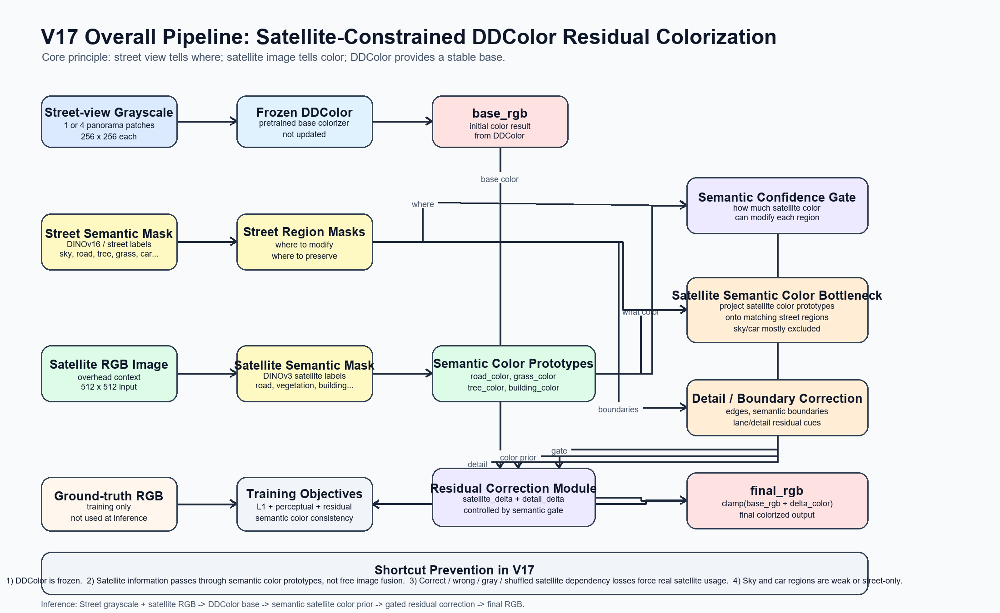

# Street-Object-Aware Satellite-Guided DDColor

Street-Object-Aware Satellite-Guided DDColor is a satellite-constrained residual colorization framework for street-view grayscale image colorization. It uses frozen DDColor as a stable base colorizer, then applies satellite-guided residual correction through semantic color priors and confidence gating.

This repository focuses on the v17 model variant.



## Core Idea

The model is designed around a simple constraint:

```text
Street view tells where.
Satellite image tells color.
DDColor provides the base colorization.
```

Instead of allowing the network to freely learn a direct mapping from grayscale street-view images to ground-truth RGB images, v17 constrains satellite information through semantic color prototypes and dependency losses.

## V17 Pipeline

```text
Street-view grayscale patch
        ↓
Frozen DDColor
        ↓
base_rgb

Street semantic mask
        ↓
Street region masks

Satellite RGB image + satellite semantic mask
        ↓
Semantic color prototypes
        ↓
Satellite semantic color bottleneck
        ↓
Semantic confidence gate
        ↓
Residual correction
        ↓
final_rgb = clamp(base_rgb + delta_color, 0, 1)
```

## Main Components

- **Frozen DDColor base colorizer**
  - DDColor is used as a pretrained base model.
  - DDColor parameters are not trained or fine-tuned.

- **Street semantic masks**
  - Identify where different street-view regions are located.
  - Used for road, vegetation, tree, building, sky, car, and fallback regions.

- **Satellite semantic color bottleneck**
  - Extracts semantic color prototypes from satellite RGB regions.
  - Projects satellite color priors onto matching street-view semantic regions.
  - Reduces the risk that the model ignores the satellite image.

- **Semantic confidence gate**
  - Controls how strongly satellite color should modify each region.
  - Sky and car regions are treated weakly or as street-only because satellite images cannot reliably explain them.

- **Residual correction**
  - The model does not regenerate the whole color image.
  - It learns a correction delta on top of the DDColor result.

## Shortcut Prevention

v17 includes several mechanisms to reduce direct shortcut learning from grayscale street-view images to RGB ground truth:

1. DDColor is frozen.
2. Satellite information is passed through semantic color prototypes instead of unconstrained image fusion.
3. Correct, wrong, grayscale, and channel-shuffled satellite inputs are used for satellite dependency loss.
4. Semantic color consistency encourages output regions to follow satellite-derived color priors.
5. Semantic gate priors limit where satellite information is allowed to affect color.

## Repository Contents

```text
app.py                         Gradio inference UI
inference.py                   Inference utilities
train.py                       Training entry point
evaluate.py                    Evaluation script
src/                           Model, dataset, losses, and utility modules
configs/                       Example configuration files
scripts/                       Helper scripts
third_party/DDColor/README.md  DDColor dependency instructions
docs/assets/                   Selected documentation figures
```

## Not Included

The following files are intentionally not tracked by Git:

- CVUSA / CVACT / custom datasets
- trained project checkpoints, including v17 `best.pth`
- official DDColor source code
- official DDColor pretrained weights
- generated logs and output images
- local Python virtual environment

This avoids uploading large binary files and third-party model weights directly into the repository.

## Required External Files

### 1. DDColor code and DDColor tiny weight

Download the official DDColor code and `ddcolor_paper_tiny` pretrained weight separately.

Expected layout:

```text
third_party/DDColor/
  ddcolor/
  weights_hf/
    ddcolor_paper_tiny/
      pytorch_model.bin
```

You can also store DDColor elsewhere and update the paths in your config file.

### 2. v17 checkpoint

Place the trained v17 checkpoint here:

```text
checkpoints/satellite_constrained_v17_server/best.pth
```

Recommended distribution options for the checkpoint:

- GitHub Releases
- Git LFS
- Hugging Face Hub
- Google Drive / OneDrive

## Dataset Layout

Expected processed dataset layout:

```text
CVUSA_processed_split/
  train/
    ground_rgb/
    ground_gray/
    overhead_satellite/
    street_dinov3_semantic_v16/
    overhead_satellite_dinov3_semantic_v16/
  val/
    ground_rgb/
    ground_gray/
    overhead_satellite/
    street_dinov3_semantic_v16/
    overhead_satellite_dinov3_semantic_v16/
  test/
    ground_rgb/
    ground_gray/
    overhead_satellite/
    street_dinov3_semantic_v16/
    overhead_satellite_dinov3_semantic_v16/
```

The exact directory names can be changed in the YAML config.

## Installation

Create a virtual environment:

```powershell
py -3.12 -m venv .venv
.\.venv\Scripts\python.exe -m pip install --upgrade pip
```

Install PyTorch first. For RTX 50-series / Blackwell GPUs, use CUDA 12.8+ compatible wheels:

```powershell
.\.venv\Scripts\python.exe -m pip install torch==2.12.0+cu130 torchvision==0.27.0+cu130 --index-url https://download.pytorch.org/whl/cu130
```

Install the remaining dependencies:

```powershell
.\.venv\Scripts\python.exe -m pip install -r requirements.txt
```

Verify CUDA:

```powershell
.\.venv\Scripts\python.exe -c "import torch; print(torch.__version__, torch.version.cuda, torch.cuda.is_available())"
```

## Configuration

Copy the example v17 config:

```powershell
Copy-Item configs\satellite_constrained_v17.example.yaml configs\satellite_constrained_v17.yaml
```

Then edit these paths:

```yaml
dataset:
  root: "PATH/TO/CVUSA_processed_split"

ddcolor:
  code_path: "PATH/TO/DDColor"
  weights_path: "PATH/TO/DDColor/weights_hf/ddcolor_paper_tiny/pytorch_model.bin"
```

## Run the Gradio UI

```powershell
.\.venv\Scripts\python.exe app.py
```

Open:

```text
http://localhost:7861/
```

By default, the UI expects:

```text
configs/satellite_constrained_v17.yaml
checkpoints/satellite_constrained_v17_server/best.pth
```

## Training

```powershell
.\.venv\Scripts\python.exe train.py --config configs\satellite_constrained_v17.yaml --exp_name satellite_constrained_v17
```

Training requires the processed dataset, semantic masks, DDColor code, and DDColor tiny weights.

## Evaluation

```powershell
.\.venv\Scripts\python.exe evaluate.py --config configs\satellite_constrained_v17.yaml --checkpoint checkpoints\satellite_constrained_v17_server\best.pth
```

Common metrics include PSNR, SSIM, LPIPS, and FID when the corresponding dependencies and reference data are available.

## Notes

- This project is a research prototype.
- The v17 method improves satellite dependency compared with unconstrained fusion, but it still depends on semantic mask quality.
- Very fine lane markings may remain difficult when they are not visible or not reliable in the satellite image.
- Sky and vehicle regions are intentionally treated differently because they are not directly explained by satellite imagery.

## Suggested Repository Name

```text
Street-Object-Aware-Satellite-Guided-DDColor
```

Suggested paper/project title:

```text
Street-Object-Aware Satellite-Guided DDColor
```
